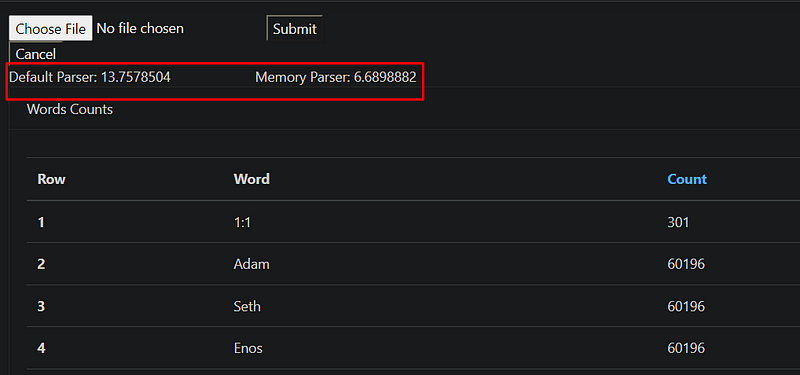
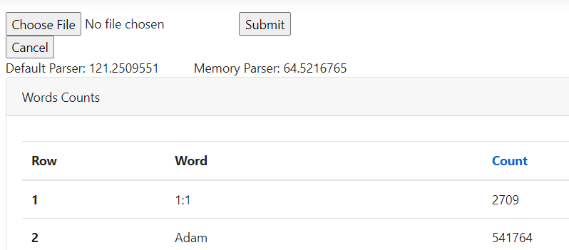

# Parsing Text File By Span and Memory
It has been a long time since Span and Memory joined our world, but I recently had a chance to look at them. If you want to use them you should have at least .Net Core 2.1. If you want to get detailed information you can look at https://docs.microsoft.com/en-us/archive/msdn-magazine/2018/january/csharp-all-about-span-exploring-a-new-net-mainstay
So what are we going to do here is we will implement a solution to parsing text files. The first one will be implemented by classic .Net codes and the second one will be implemented by Span and Memory.
We will write a method and the method will read all of the text inside the file then it will count the occurrences of the words. Like a word how many times used in the text.

For example, we have a text file like this;

And the result should be;

So let's start to write our project;

In order to implement multiple parsers, we need one interface to return pairs.

Our classic Parser;

Because StreamReader has the ReadLine method we will use it. Then we count if there is an occurrence.

And the second one is here. Here I tried to write code to do the same thing with our classic example. Because there is no ReadLine method that implements Memory buffer I wrote something as if it is ReadLine.

As you can see above we have Memory<char> and we read text file char by char until it is a new line then we create a string by our read chars. Then we do the same thing as we do in our classic example. If we had a split method like Span<string> char[].Span that would be awesome too.

So let's see what their effects are on files.

After injecting the list of IFileParser we watched them on a higher than 50MB text file and the result is an average of 7 seconds with MemoryParser.

{: .mx-auto.d-block :}

Also, if you look at diagnostic tools you can see that CPU usage is less than the classic one.
If you try on a file larger than 450MB you can see below that it takes %50 shorter than the classic one. And these results are not got on the released version they get on the debug version.

{: .mx-auto.d-block :}

Note: If there is any problem with my codes don't hesitate to comment about it.